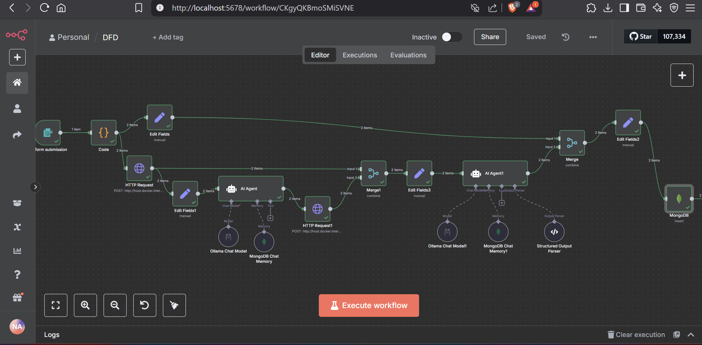

# 📘 README.md

A modular, locally deployable certificate forgery detection system that leverages **Vision Transformers**, **OCR + Metadata analysis**, **AI text detection**, and **LLM-based reasoning** to evaluate whether certificates are genuine or fraudulent. Built using **FastAPI**, **n8n**, **MongoDB**, and **Ollama**.



---

## 🚀 Key Features

* 🔍 **Multi-signal Detection**: Combines ViT classifier, AI-text detector, OCR anomaly analysis, and metadata insights
* 🤖 **Explainable Classification**: LLM-generated reasoning for every decision
* 🧠 **Ollama LLM and HuggingFace Classifiers**:  LLMs for text formatting and fraud reasoning, classifiers to detect ai generated text and forged documents 
* 🔗 **FastAPI Server**: Central backend exposing `/analyze_image` and `/classify_text` endpoints
* 📅 **n8n Workflow**: Fully visual, file-driven pipeline with form input, HTTP orchestration, and MongoDB storage
* 📊 **MongoDB Storage**: Final results stored with filename, classification, confidence, and LLM explanation

---

## 🌐 API Endpoints (FastAPI Server)

| Endpoint         | Description                                                                      |
| ---------------- | -------------------------------------------------------------------------------- |
| `/analyze_image` | Receives a certificate image, returns OCR text, metadata, and ViT classification |
| `/classify_text` | Classifies cleaned OCR text as Human- or AI-written                              |

---

## 📂 Repository Structure

```
document_forgery_detection/
├── data/
│   ├── train/ valid/ test/                 # Image dataset (Roboflow-style) for training VIT
│── tests/                                  # Image dataset for testing n8n workflow
├── scripts/
│   ├── train_vit_classifier.py             # Fine-tune ViT on certificate images
│   ├── test_pred_vit_classifier.py         # Evaluate on test set or predict on new image
│   ├── extract_metadata.py                 # Extract EXIF, PIL, hachoir, XMP
│   ├── ocr_plus_analysis.py                # HOCR OCR + anomaly detection
│   ├── classify_text_humanOai.py           # Use RoBERTa-based AI-text detector
│   └── server.py                           # FastAPI server with endpoints
├── workflows/
│   └── Document_Forgery_Detection_workflow.json  # n8n flow for full pipeline
├── docs/
│   ├── README.md
│   └── technical-approach.md
├── .env
├── compose.yaml
└── pyproject.toml
```

---

## 🧪 Run Locally

### Prerequisites

* Python 3.10+
* Docker & Docker Compose
* Tesseract OCR (ensure it's in `PATH`)
* Ollama installed locally with `llama3` and `qwen3` models pulled

### Setup (Python & FastAPI)

```bash
uv venv
uv sync
uv run scripts/server.py
```

API server runs at: `http://localhost:8000`

---

## 🔄 n8n Workflow

### Launch Instructions

1. Start n8n:

   ```bash
   docker compose up n8n
   ```

2. Open Editor UI:
   [http://localhost:5678](http://localhost:5678)

3. Trigger Form:
   [http://localhost:5678/form-test/2e96ea7a-c5a1-44cf-a41e-3b7c20cc9830](http://localhost:5678/form-test/2e96ea7a-c5a1-44cf-a41e-3b7c20cc9830)

### Workflow Description

* 📄 **Form Trigger**: Accepts `.jpg`/`.png` certificate files.
* 🥈 **Binary Split + POST**: Sends each file to `/analyze_image`.
* 🧠 **LLM Agent #1**: Formats OCR text (Llama3).
* 🤖 **AI Text Detection**: Classifies as Human- or AI-generated.
* 📊 **LLM Agent #2**: Makes final decision based on all reports.
* 🗏️ **MongoDB Insert**: Stores to `Document_Store` in `{ filename, output }` format.

---

## 🧠 Example Output

```json
{
  "filename": "sample.jpg",
  "output": {
    "document_classification": "fraudulent",
    "confidence": 95.5,
    "explanation": "The VIT_classifier_report labeled the document as fraudulent with 94.2% confidence, and the AI_detection identified it as AI-generated with 96.8% confidence. These findings strongly indicate the document is synthetic, with consistent signals across both analyses."
  }
}
```

---

## 📌 Future Enhancements

* Fine-tune the AI text detector for domain-specific certificates
* Add PDF support and multipage OCR handling
* Stream responses in real time via WebSocket
* Build an admin dashboard UI for visualization

---

## 📜 License

MIT License
