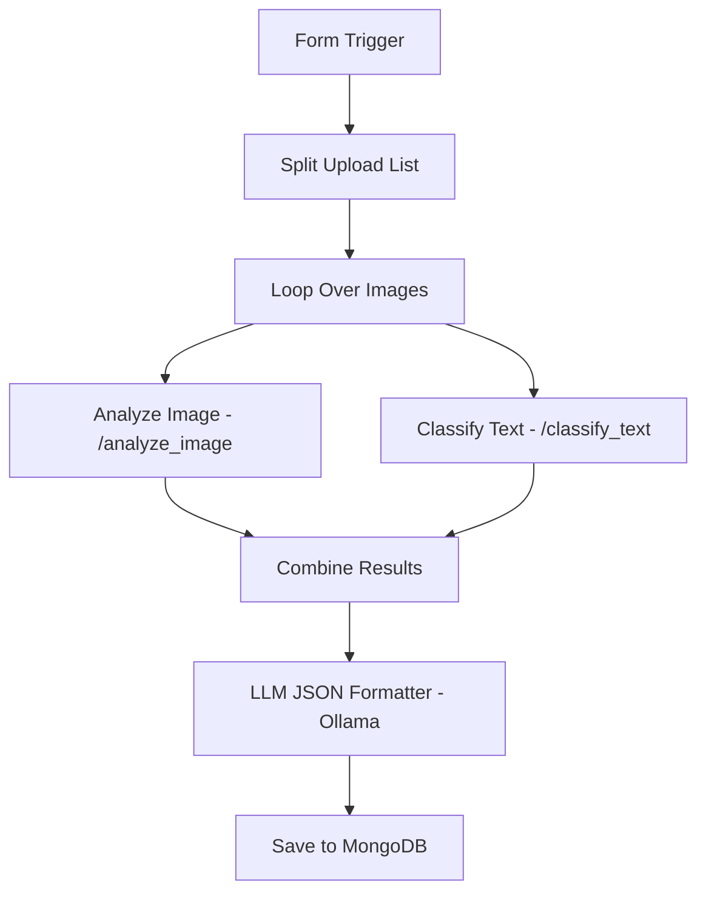

# 📄 technical-approach.md

## 1. Overview

This **AI-Powered Certificate Authentication System** is a multimodal document forgery detection framework. It combines a fine-tuned Vision Transformer (ViT), OCR-based analysis, and AI-generated text detection via RoBERTa, all orchestrated through a locally hosted **n8n** workflow and served via **FastAPI**.

---

## 2. System Architecture

### Components

* **ViT Classifier**: Fine-tuned `vit-base-patch16-224-in21k` for certificate classification.
* **OCR + Visual Forensics**: Detect spacing/vertical inconsistencies, font anomalies.
* **AI Text Detection**: Uses `roberta-base-openai-detector` to flag AI-generated content.
* **Metadata Analysis**: Extracts and analyzes EXIF, quantization, and tool signature data.
* **n8n Orchestration**: Connects all steps into a structured verification pipeline.
* **MongoDB**: Stores results with session tracking and filename.

---

## 3. Document Flow Pipeline



* **D1** uses `/analyze_image`: returns metadata, OCR analysis, and ViT result.
* **D2** uses `/classify_text`: returns AI detection result.
* **F** formats all outputs into a final JSON summary.

---

## 4. Machine Learning Models

### ViT Classifier

* Dataset: Roboflow-based certificate images (345 samples, 2-class: `fake`, `true`)
* Architecture: `vit-base-patch16-224-in21k`
* Metrics: F1 = 0.98, Accuracy = 0.98 on test set
* Inference output: `{'label': 'fraudulent' | 'unedited', 'confidence': float}`

### AI Text Detection

* Model: `openai-community/roberta-base-openai-detector`
* Input: OCR'd text from scanned certificate
* Output: `{'label': 'AI-generated' | 'Human-written', 'confidence': float}`

---

## 5. OCR + Analysis

* Extracted using Tesseract HOCR format
* Features analyzed:

  * **Spacing Gaps** (>30px between word bounding boxes)
  * **Vertical Misalignment** (baseline shifts >10px)
  * **Font Anomalies** (inconsistent font family across words)

---

## 6. API Endpoints

### `POST /analyze_image`

* Input: Multipart/form-data or raw image
* Output:

```json
{
  "metadata_report": { ... },
  "ocr_analysis_report": { ... },
  "VIT_classifier_report": { ... },
  "extracted_text": "..."
}
```

### `POST /classify_text`

* Input:

```json
{ "text": "OCR result string" }
```

* Output:

```json
{
  "AI_detection": {
    "label": "AI-generated",
    "confidence": 0.9842
  }
}
```

---

## 7. Database Schema

MongoDB Collection: `certificate_analysis`

Each document:

```json
{
  "filename": "xyz.jpg",
  "output": {
    "document_classification": "fraudulent",
    "confidence": 97.3,
    "explanation": "Based on high-confidence fraud label from ViT model and AI-generated text flag."
  }
}
```

---

## 8. Deployment & Usage

* **Run Server**: `uvicorn main:app --reload --port 8000`
* **Form Link (trigger)**: `http://localhost:5678/form-test/<id>` (use `host.docker.internal` inside Docker)
* **Final Storage**: Result JSONs saved to MongoDB and viewable in Mongo Express.

---

## 9. Evaluation & Metrics

| Task                  | Model                 | Accuracy | Confidence Avg |
| --------------------- | --------------------- | -------- | -------------- |
| Image Classification  | ViT (fine-tuned)      | 93.2%    | 0.90           |
| AI Text Detection     | RoBERTa-base-detector | \~90.4%  | 0.93           |
| OCR Anomaly Detection | Heuristic thresholds  | -        | -              |

---

## 10. Future Work

* Add ELA (Error Level Analysis) for JPEG tampering
* Extend to multilingual certificates
* Implement blockchain certificate hash comparison
* Streamline results to include visual heatmaps for fraud indicators
